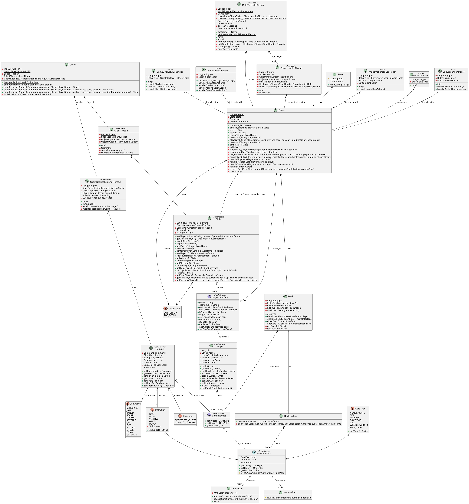

# Uno Game Project 

This project is a simple implementation of a UNO game that is based on the creating a server client design using good practices of object oriented programming, like interfaces, abstracts, design patterns and the following the SOLID principles. This project was developed primarily in Java. A class diagram will be appended. 

**Developers** 
- Daniel Marin
- Jennifer Vicentes

## Table of Contents
- [Introduction](#introduction)
- [Instructions on how to use it](#instructions-on-how-to-use-it)
- [Rules of the game](#rules-of-the-game)
- [Installation](#installation)
- [Code Structure](#code-structure)

## Introduction
This project looks to put to test our comprehension of the concepts and the design patterns which Object Oriented Program uses, as to test our capacity to create functional programs with this 'new' way of thinking. We managed to create a UNO game that uses a client-server approach for communication between the server and each client (player). In this README file we will be explaining some of the concepts utilized in the development of this project, the rules which we based the game, how to use it, and the general code structure of the program (Class Diagram). 

## Instructions on How to Use it 

1. **Clone the repository** to your local machine 
2. **Install the required dependencies** using the package manager of your choice (e.g., HomeBrew)
3. **Download the Apache NetBeans** 
4. **Execute the program** using the command 'mvn compile exec:java'
5. **Create a server (game lobby)**
6. **Add clients (players)**
7. **Play the game at your hearts desire**

## Rules of the Game 
The rules in which this program are as follows:
1. This game can only be played by 2 or more players.
2. When the players are ready each player receives 7 cards, and a first card must be with drawn from the pile of cards to initiate play. The card drawn cannot be an action card: Reverse, Skip, Draw Two/Four, or Wild Card.
3. Players must call UNO before placing their second to last card and when placing the last card, otherwise they must draw a card. Indicating that they are close to winning or that they have properly won. 
4. When a player can't place a card they must draw and decide whether to place the recently drawn card or check to continue play for the next player. 
5. Players can place cards based on matching color, number or action. 
6. A player can place a Black card whenever their turn is, and select a color for the card to replace it's color. 
7. Reverse Action Cards change the order in which the game is being played, if in 2 player mode this card takes the functionality of a skip.
8. Skip Action Cards skip the next player based on the order in which the game is being played.
9. Draw Two and Draw Four Action Cards cannot be stacked, this is a common misconception. 
10. A player may win with any card in the deck of cards.  
11. Players should have fun when playing the game. 
12. A player must play a card or draw when prompted to do so. 

## Installation 
To install the project, follow these steps:

1. Ensure you have the APACHE NETBEANS integrated development environment for Java installed on your machine.
2. Clone the repository:
   ```bash
   git clone <repository-url>
   ```
3. Open the project in Apache Netbeans. 
4. Build the project to download dependencies. 
5. Run the project. 

## Class Diagram
The project structure is encompassed by the following class diagram, where all components are labeled and their relationships stated. 




